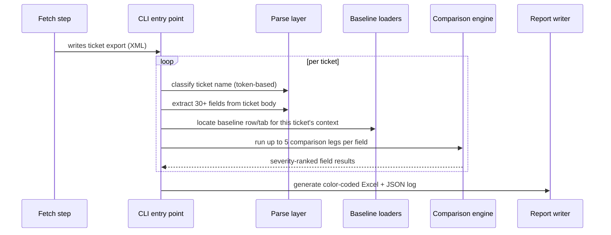

# ShipAudit — Shopee Automation Pipeline

> Sanitized portfolio version. Company name, real business data, credentials, and proprietary channel/voucher naming have been removed or genericized throughout. Architecture, logic, and design decisions are presented as they actually shipped.

---

## TL;DR

A production internal tool that verifies e-commerce shipping-promotion tickets against approved baseline spreadsheets before campaigns go live. Originally built as an LLM-driven, field-by-field comparison assistant; rebuilt over four iterations into a deterministic, config-driven Python engine that runs in seconds instead of 15–20 minutes per ticket — while keeping a Claude Code agent layer on top for orchestration, judgment calls, and reporting. The case study below is as much about **deciding where an LLM belongs in a pipeline** as it is about the Python underneath it.

---

## The story: choosing *not* to use an LLM

| Version | What changed |
|---|---|
| **v2** | An LLM compared 20–40 fields per ticket one at a time against two baseline documents. Worked, but took 15+ minutes per ticket and had no automated way to pull the baseline sources. |
| **v3** | Moved the actual comparison logic into deterministic Python. The LLM's role shrank to formatting the final report. |
| **v3.2** | Added browser automation to fetch login-gated baseline spreadsheets at runtime, removing a manual download step. |
| **v4** | Removed the browser/runtime-fetch dependency entirely — baseline files are pre-downloaded once, and a pure-Python 5-leg comparison engine reads them directly. Introduced a REST API fetch step to remove the last manual step (ticket export). |

Each version removed exactly one piece of unnecessary LLM/runtime overhead, without losing any of the original capability. By v4, the LLM's remaining job is orchestration and judgment — not field-by-field arithmetic it was never the right tool for in the first place. That's the core engineering decision this project demonstrates: **recognize when non-determinism, latency, and cost are being spent on a problem that a few hundred lines of deterministic code solve better, and re-architect toward that — without throwing away the parts where language understanding actually adds value.**

---

## Architecture deep dive

**Two decoupled phases**, connected only by a file on disk:

- **Fetch phase** — an optional pre-step that queries a REST API (paginated JQL-style search, PAT auth, structured error handling for auth/network/no-results cases) and writes a ticket export in the same format a manual export would produce. The comparison engine has no idea which path produced the file.
- **Comparison phase** — parse → load baselines → compare → report. Fully deterministic; same inputs always produce the same outputs.

**Module layering**, roughly in call order: `xml_parser` → `ticket_parser` / `description_parser` → `*_loader` modules (form, policy, tier-specific baselines) → `comparator` → `run_manager` / `excel_generator`. Each module has one job and is independently unit-tested.

---

## Engineering highlights

**Order-independent token classification parser.** Ticket names pack multiple attributes — channel, campaign type, date, audience segment — into one delimited string, but the token order isn't fixed. Rather than positional parsing, each token is classified by *what it looks like* (matches a known channel keyword? a date pattern? a flag character?), with a two-stage resolution step afterward for compound attributes that need a base token plus a qualifier token appearing anywhere else in the string. This makes the parser resilient to the inconsistent naming conventions that inevitably show up across a large, human-authored ticket volume.

**Severity-ranked, multi-leg comparison engine.** Every field can be checked across up to five independent legs (ticket-vs-form, ticket-vs-policy, form-vs-policy, ticket-vs-rules, form-vs-rules). Results aggregate through a fixed severity precedence (`mismatch > warning > needs-manual-review > missing > match`), exposed as computed properties on plain data classes — no ORM, no serialization framework, just properties that are easy to reason about and cheap to test.

**Config-as-extension-point.** The field mappings and validation rules that drive comparison live entirely in JSON. Adding a new field to verify, changing an expected value, or adjusting a validation rule is a config edit — zero code changes, zero redeploys, for the change requests that come up most often in practice. Code changes are reserved for genuinely new ticket types or new comparison legs.

**Fail-soft by design.** A ticket with a non-standard name doesn't halt the batch — it's quarantined into a separate flagged list with a human-readable reason, and the rest of the run continues. Missing baseline tabs, missing policy sections, and unresolvable formula references all degrade to an explicit "needs manual review" or "missing" state rather than throwing. The system is built to never silently drop a ticket and never crash a whole batch over one bad row.

**Test strategy.** One test file per `lib/` module, plus a full integration test that runs the actual pipeline entry point against in-memory fixture workbooks — meaning the suite validates real end-to-end behavior without needing any real spreadsheet files, so it runs anywhere, including CI.

---

## The agent orchestration layer

This is the part most relevant to an AI engineer / forward-deployed engineer role: **the Python engine above isn't invoked directly by a human — it's fronted by a Claude Code agent skill file** that turns it into a scoped, repeatable "coworker" workflow rather than a one-off script:

- **Project-level override instructions** (a `CLAUDE.md`-equivalent) enforce that the agent reads a specific, version-pinned skill playbook for this task rather than falling back to general-purpose defaults — so behavior stays consistent as the skill evolves across versions (v3 → v3.2 → v4).
- **Trigger-phrase design** maps natural, non-technical requests ("run analysis for this period", "check these tickets") to a fixed execution plan, so the person operating it never needs to know the underlying CLI syntax.
- **Lazy, scoped permission grants** — the agent requests shell/file-system permission only immediately before the specific command that needs it, scoped to that single command, rather than requesting broad access up front.
- **Pre-flight validation baked into the playbook** — required files, tab-name conventions, and file-freshness checks are verified *before* any processing starts, with a hard stop and a clear ask back to the human if inputs are missing or stale.
- **Human-in-the-loop by construction** — the tool only reads and reports. All judgment calls (is this warning acceptable? is this mismatch real?) are explicitly routed back to a human reviewer, both in the tool's design and in the skill file's instructions.

This layer is what makes the underlying engine actually usable day-to-day by non-technical staff — the deterministic Python does the verification; the agent layer handles intent parsing, sequencing, permissioning, and reporting.

---

## Skills demonstrated

- **Python system design** — layered modules, plain dataclasses with computed properties, clean separation between parsing / loading / comparing / reporting
- **Config-driven rule-engine design** — JSON-schema-defined field mappings and validation rules as the primary extension point
- **Text extraction from semi-structured input** — token classification, label-based field extraction from free-text bodies
- **REST API integration** — paginated search, token auth, structured failure handling (auth, network, empty-result, bad-query)
- **Reporting/data-output engineering** — programmatic Excel generation with conditional styling, plus full JSON audit logs
- **Test-driven development** — module-level unit tests, fixture-based integration testing, no-external-dependency CI runs
- **CLI tool design** — `argparse`-based entry points with auto-detected optional inputs and clear failure messages
- **Agent / skill design for Claude Code** — trigger-phrase mapping, scoped permission models, pre-flight checks, human-in-the-loop workflow design
- **Technical communication** — maintaining parallel technical and non-technical documentation for the same system, for different audiences

## Tech stack

Python 3.9+ · `REST API` · `openpyxl` · `requests` · `pytest` · JSON config · Mermaid diagrams for documentation · Claude Code for agent orchestration
