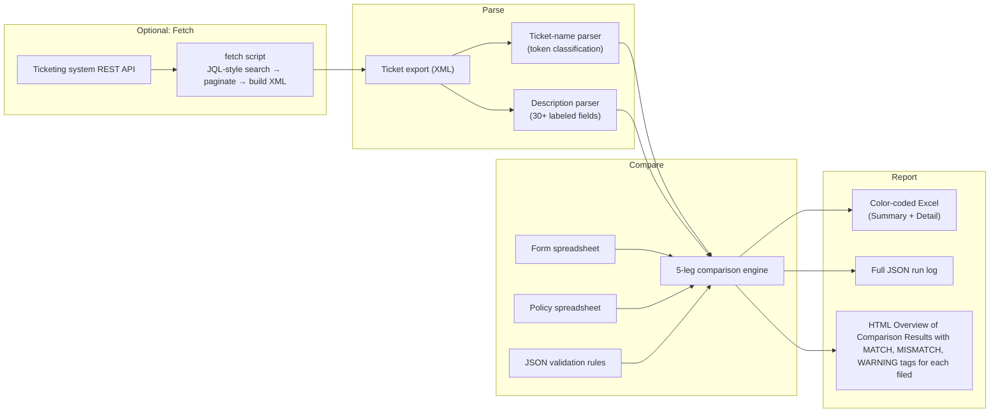

# ShipAudit - Automation Pipeline

**Automated verification for e-commerce shipping-promotion tickets — turns a over 20-hour manual review cycle into a few minutes.**

> This is a sanitized, portfolio version of an internal automation tool. All company names, real business data, credentials, and proprietary channel/voucher naming have been removed or genericized. Structure, logic, and architecture are unchanged.

---

## What it does

E-commerce shipping promotions are configured through tickets in a ticketing system (e.g. Jira). Before a promotion goes live, every ticket needs to be checked against two independent sources of truth — an approved **form** spreadsheet and a **policy** spreadsheet — plus a set of structural validation rules. Historically this was done by hand: open the ticket, open two spreadsheets, cross-reference 40-50 fields, repeat for every ticket in the batch.

**ShipAudit automates that entire check.** Point it at a ticket export and the two baseline spreadsheets, and it produces a color-coded Excel report showing exactly which fields match, which don't, and which need a human's judgment call.

The tool is intentionally **read-only** — it never modifies tickets, spreadsheets, or anything else. It only reports.

## The problem it solves

| | Manual review | ShipAudit |
|---|---|---|
| Time per ticket | 15–20 minutes | — (batch runs in seconds) |
| Tickets per cycle | 40–70 | 40–70 (no change) |
| Total review time per cycle | 20+ hours | Minutes (review only flagged rows) |
| Missed-field risk | High (fatigue, manual cross-referencing) | Eliminated — every field, every time |
| Runtime dependencies | Browser session, live logins | None — fully offline once baseline files are downloaded |

## Architecture at a glance



## Key features

- **5-leg ("pentagon") comparison** — each field can be checked ticket-vs-form, ticket-vs-policy, form-vs-policy, ticket-vs-rules, and form-vs-rules, independently.
- **Config-driven rules** — adding a field to check, or changing what value is expected, is a JSON edit. No code changes or redeploys for the most common change requests.
- **Order-independent name parser** — ticket names encode multiple attributes (channel, campaign type, date, audience segment) in a single string; the parser classifies each token by content rather than position, so field order doesn't matter.
- **Fail-soft, never fail-stop** — a ticket with a non-standard name is quarantined into a separate "flagged" list with a reason; the rest of the batch keeps processing.
- **Versioned outputs** — every run gets its own auto-numbered output folder. Nothing is ever overwritten; every past run stays inspectable.
- **Two output artifacts** — a human-readable, color-coded Excel workbook, and a full JSON serialization for downstream tooling.
- **Zero runtime network/browser dependency** — baseline spreadsheets are pre-downloaded once; the comparison engine runs entirely offline.

## Tech stack

- **Language:** Python 3.9+
- **Libraries:** `openpyxl` (Excel read/write), `requests` (API fetch), `pytest` (testing)
- **Config:** plain JSON (field mappings + validation rules) — no database, no ORM
- **Interface:** CLI (`argparse`)

Deliberately dependency-light so it can run in any restricted environment with no external services beyond a one-time file download.

## Project structure

```
compare.py            # CLI entry point — orchestrates the full pipeline
fetch_jira.py          # Optional pre-step — pulls tickets from the API into an XML export
lib/
  xml_parser.py        # Ticket export → raw per-ticket dicts
  ticket_parser.py      # Ticket-name → {type, campaign, channel, segment, date}
  description_parser.py # Ticket body text → 30+ structured fields
  form_loader.py         # Spreadsheet tab lookup utility
  loyalty_loader.py     # Reads tier-specific baseline spreadsheets
  policy_loader.py       # Reads per-channel policy values
  rules_loader.py         # Loads + applies JSON validation rules
  comparator.py         # The 5-leg comparison engine
  channel_map.py         # Numeric ID → display-name mapping
  workbook_validator.py # Pre-flight spreadsheet checks
  run_manager.py         # Versioned output-folder management
  excel_generator.py     # Color-coded Excel report writer
  models.py             # Core data classes (RunResult / TicketResult / FieldResult)
config/                # JSON field-mapping and validation-rule files, per ticket type
rules/                 # Plain-English documentation of the JSON rules
tests/                 # pytest suite, 1:1 with lib/ modules + integration test
```

## How the pipeline works

1. **Fetch (optional):** queries the ticketing system's REST API for open shipping-promotion tickets and writes a ticket export file. Fully decoupled from the rest of the pipeline — a manually exported file works identically.
2. **Parse:** the ticket-name parser classifies each token in the ticket name (channel, campaign type, date, audience segment); the description parser extracts 30+ labeled fields from the ticket body.
3. **Load baselines:** the form and policy spreadsheets are opened and the relevant tab/row/column for this ticket's context is located.
4. **Compare:** up to 5 independent comparison legs run per field. Results are aggregated by severity: `mismatch > warning > needs manual review > missing > match`.
5. **Report:** a two-sheet Excel workbook (Summary + Detailed Results) is generated, color-coded by outcome, alongside a full JSON log of the run.

## Testing

The `tests/` suite has one file per `lib/` module plus a full end-to-end integration test that exercises `compare.py`'s `main()` against in-memory fixture workbooks — no real spreadsheet files are needed to run the suite.

```bash
python -m pytest
```

## Related documentation

- `PORTFOLIO.md` — engineering case study and design rationale
